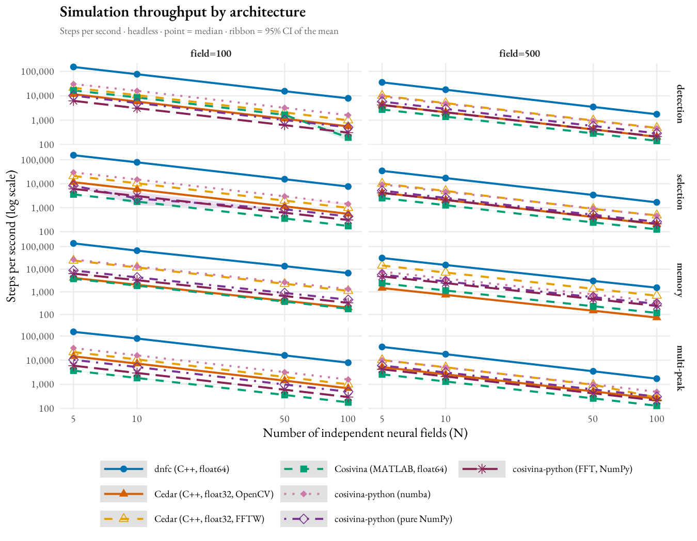
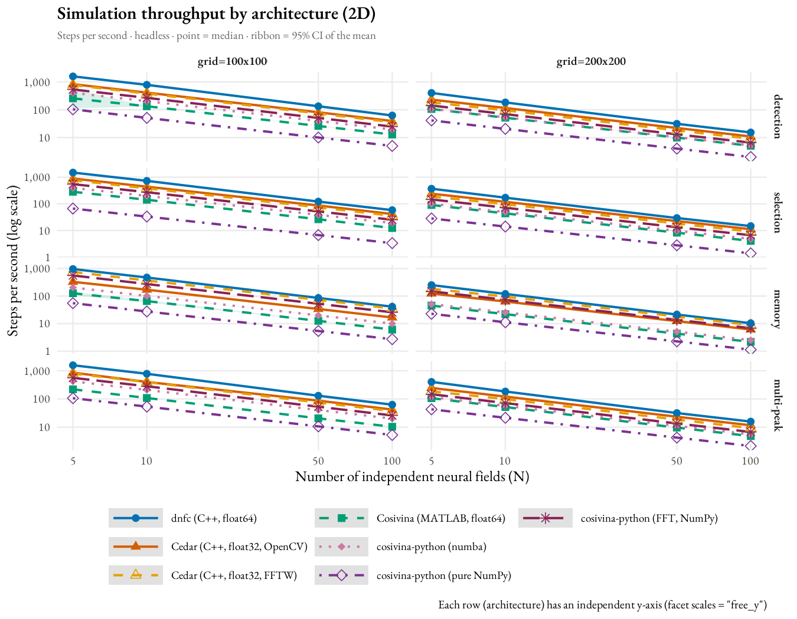

# DFT Framework Benchmarking and Cross-Platform Validation

This repository documents two independent studies comparing four implementations of **Dynamic Field Theory (DFT)** — a mathematical framework for modelling neural population dynamics. The studies measure runtime performance and verify numerical correctness across frameworks.

---

## Frameworks

| Framework | Language | Precision | Version |
|---|---|---|---|
| [Cedar](https://github.com/cedar/cedar) | C++ | float32 | 6.2.0 |
| [Cosivina](https://github.com/cosivina/cosivina) | MATLAB | float64 | 1.4.0 |
| [cosivina-python](https://github.com/cosivina/cosivina_python) | Python / NumPy | float64 | 0.1.0 |
| [dnf-composer](https://github.com/Jgocunha/dynamic-neural-field-composer) | C++ | float64 | 2.9.3 |

All frameworks implement the 1D Amari equation:

```
τ · du/dt = −u + h + w * σ(u) + S
```

---

## Implementation Differences

The seven benchmarked variants differ in more than raw speed — each combines a different
convolution algorithm, SIMD mechanism, and threading model. These are framework
characteristics, not benchmark artifacts; see `TRADE_OFF_CAVEATS.md` for how each is
controlled for or disclosed.

| Variant | Language | Precision | Convolution | SIMD mechanism | Threading control | Per-step overhead |
|---|---|---|---|---|---|---|
| dnfc | C++ | float64 | Hybrid: direct spatial (truncated kernel, hand-written AVX2+FMA) below a tap-count threshold, FFTW spectral (full field) above it — currently wired for `MexicanHatKernel2D` only, circular boundaries only, grid ≥ 100×100 | Compile-time `/arch:AVX2` (+ runtime `cpuid` fallback for non-AVX2 CPUs); FFTW selects its own SIMD codelets at runtime | No thread pool (single-threaded by construction); env vars pinned defensively | Flat element-handle loop, no locking |
| Cedar (OpenCV engine) | C++ | float32 | Direct spatial, truncated kernel (`cv::filter2D`) | Cedar's own code has no arch flag; OpenCV dispatches AVX2/AVX-512 at runtime via `cpuid` | `cv::setNumThreads(0)` | Qt read/write locks, `onTrigger` dispatch, `copyMakeBorder` allocation |
| Cedar (FFTW engine) | C++ | float32 | Spectral, full field (FFT × FFT → inverse FFT) | FFTW selects SIMD codelets at runtime | `cv::setNumThreads(0)` | Same Cedar structural tax as OpenCV engine |
| Cosivina (MATLAB) | MATLAB | float64 | Direct spatial, truncated kernel (`conv2`) | MATLAB's bundled vendor BLAS, runtime-dispatched | `maxNumCompThreads(1)` | Interpreted per-step loop overhead |
| cosivina-python (numba) | Python | float64 | Direct spatial, truncated kernel (`np.convolve`/`parCircConv`) | numba JIT via LLVM, host-CPU-targeted (AVX2 on this machine) | Six `*_NUM_THREADS=1` env vars | Per-element jitclass dispatch |
| cosivina-python (nonumba) | Python | float64 | Direct spatial, truncated kernel, pure NumPy | NumPy/BLAS, runtime-dispatched | Six `*_NUM_THREADS=1` env vars | Per-element pure-Python dispatch |
| cosivina-python (fft) | Python | float64 | Spectral, full untruncated field (`KernelFFT`, `rfft2`/`irfft2`) | NumPy FFT (pocketfft), runtime-dispatched; no numba implementation exists | Six `*_NUM_THREADS=1` env vars | Per-element pure-Python dispatch |

All seven use the identical logistic-sigmoid activation (β=100) in the throughput
benchmark — Cedar's is its stock `ExpSigmoid` class, config-selected to override its
factory-default `AbsSigmoid`. See `cross-platform-validation/README.md` §2.4 for the
full activation-function equivalence table across frameworks.

---

## Repository Layout

| Directory | Contents |
|---|---|
| [`benchmarking/`](benchmarking/README.md) | Performance benchmark (1D): N independent neural fields (N ∈ {5, 10, 50, 100}) across 4 canonical regimes and 3 field sizes, measuring simulation steps per second |
| [`benchmarking-2d/`](benchmarking-2d/README.md) | Same performance benchmark on 2D (100×100 / 200×200 / 500×500) fields |
| [`cross-platform-validation/`](cross-platform-validation/README.md) | Correctness study (1D): 100 DFT simulations across 5 architectures, verifying algebraic equivalence and behavioural reliability |
| [`cross-platform-validation-2d/`](cross-platform-validation-2d/README.md) | Same correctness study on 2D (50×50) fields |

---

## Benchmark Results (1D)

Each benchmark creates N independent neural fields (N ∈ {5, 10, 50, 100}), across 4 canonical
regimes (detection, selection, memory, multi-peak) and 3 field sizes, and measures wall-clock steps
per second (median of 10 runs × 500 steps each). The five spatial variants convolve the same real
kernel support and all variants use matched activation functions (the two spectral variants —
Cedar-FFTW and cosivina-python-FFT — convolve the full field in the Fourier domain; see
`TRADE_OFF_CAVEATS.md` and `benchmarking/README.md` *Benchmark Design* for how).

### Steps per second at N=100 (median across regimes' range)

| Framework (variant) | field=100 | field=500 |
|---|---:|---:|
| dnfc | 6 735–7 884 | 1 527–1 746 |
| cosivina-python (numba) | 1 330–1 597 | 384–487 |
| Cedar (FFTW) | 984–1 112 | 283–678 |
| cosivina-python (NumPy) | 431–511 | 257–307 |
| cosivina-python (FFT) | 296–329 | 212–240 |
| Cedar (OpenCV) | 202–684 | 73–253 |
| Cosivina (MATLAB) | 173–195 | 118–142 |

**dnfc is by far the fastest** in every regime (38–44× Cosivina at field=100, 12–13× at field=500),
with **numba-JIT cosivina-python second** at both field sizes. See
[`benchmarking/README.md`](benchmarking/README.md) for the full per-regime breakdown, methodology,
and statistical detail.



---

## Benchmark Results (2D)

The same regime × N sweep on **2D (100×100, 200×200, or 500×500) fields**, where the lateral
convolution dominates each step. All seven variants, all four regimes, all three grid sizes.

### Steps per second at N=100 (median across regimes' range)

| Framework (variant) | grid=100 | grid=200 |
|---|---:|---:|
| dnfc | 42.2–63.6 | 10.8–15.7 |
| Cosivina (MATLAB) | 16.4–38.6 | 5.3–12.6 |
| Cedar (OpenCV) | 16.5–43.2 | 6.2–11.6 |
| Cedar (FFTW) | 35.3–37.0 | 8.9–9.2 |
| cosivina-python (numba) | 9.8–20.2 | 2.5–5.5 |
| cosivina-python (FFT) | 25.1–25.9 | 6.6–6.8 |
| cosivina-python (NumPy) | 2.7–5.3 | 1.1–2.1 |

**dnfc wins every regime at both grids**, but narrowly (1.2–2.6×) compared to 1D — 2D's
convolution-dominated step gives Cedar's and Cosivina's convolution paths much more room to
compete. A genuinely surprising, investigated finding: **Cosivina (MATLAB) is competitive with, and
sometimes beats, both Cedar engines** — traced to Cedar's general-framework overhead (locking,
trigger dispatch, allocation), not a bug; see [`benchmarking-2d/README.md`](benchmarking-2d/README.md)
*Key observations* and [`TRADE_OFF_CAVEATS.md`](TRADE_OFF_CAVEATS.md) §5 for the full account. A
second crossover appears **within** cosivina-python: the spectral **FFT** variant is now the *fastest*
of its three variants (≈25 sps vs numba's 10–20 and NumPy's 3–5 at grid 100), the reverse of 1D —
FFT's kernel-width-independent cost pays off once the field is 2D, and it stays flat across regimes
where the spatial variants slow on the wide memory kernel.



---

## Cross-Platform Validation Results (1D)

100 simulations were run across 5 DFT architectures (detection, selection, memory, insufficient, multi-peak), each executed in two phases (stimulus ON / OFF), across **seven framework variants** (Cedar-OpenCV, Cedar-FFTW, Cosivina, cosivina-python-numba, cosivina-python-nonumba, cosivina-python-fft, dnfc). Every same-activation-function-family pair is compared: **27 pairs** total (3 AbsSigmoid + 3 Heaviside + 21 logistic-sigmoid, C(7,2), since Cedar's built-in `ExpSigmoid` gives it a working logistic-sigmoid variant too and the seventh variant, cosivina-python-fft, uses cosivina's spectral `KernelFFT` element).

### Algebraic equivalence (same activation function family)

**All 27 pairs PASS.** A representative subset:

| Comparison pair | Max abs(Δu) | Threshold | Result |
|---|---:|---:|---:|
| Cedar (OpenCV) AbsSigmoid vs dnfc AbsSigmoid | 1.00×10⁻⁴ | 2×10⁻⁴ | **PASS** |
| Cedar (OpenCV) Heaviside vs dnfc Heaviside | 1.00×10⁻⁴ | 2×10⁻⁴ | **PASS** |
| Cedar (OpenCV) Sigmoid vs dnfc Sigmoid | 1.00×10⁻⁴ | 2×10⁻⁴ | **PASS** |
| Cosivina Sigmoid β=100 vs dnfc Sigmoid β=100 | 5.00×10⁻⁵ | 1×10⁻⁴ | **PASS** |
| cosivina-python Sigmoid β=100 vs dnfc Sigmoid β=100 | 5.00×10⁻⁵ | 1×10⁻⁴ | **PASS** |
| cosivina-python Sigmoid β=100 vs Cosivina Sigmoid β=100 | 5.00×10⁻⁵ | 1×10⁻⁴ | **PASS** |
| cosivina-python FFT (spectral) vs dnfc Sigmoid β=100 | 5.25×10⁻⁵ | 1×10⁻⁴ | **PASS** |

All same-family pairs pass; deviations are bounded by float32 rounding (Cedar) or accumulated float64 error over 500 integration steps (MATLAB / Python / dnfc). The spectral cosivina-python-fft variant is equivalent to the spatial variants (FFT over the full field ≈ truncated spatial convolution). Full 27-pair table in [`cross-platform-validation/README.md`](cross-platform-validation/README.md).

### Behavioural reliability

**5400 / 5400 comparisons (100%)** show qualitative agreement across all frameworks, simulation types, phases, and activation function families. No simulation produces a qualitative discrepancy (bump in one framework, no bump in another).

See [`cross-platform-validation/README.md`](cross-platform-validation/README.md) for the full experimental design, cross-family deviation analysis, and figures — including §2.8 on how the 100-simulation test suite was generated (LLM prompt).

---

## Cross-Platform Validation Results (2D)

The same 100-simulation, 5-architecture suite was run on **2D (50×50) fields** across all **seven
framework variants** (Cedar-OpenCV, Cedar-FFTW, Cosivina, cosivina-python-numba,
cosivina-python-nonumba, cosivina-python-fft, dnfc) — same 27 comparison pairs as 1D. Stimuli are
placed on the grid diagonal and kernel amplitudes are re-tuned per architecture type (a normalized
2D Gaussian is ~7.5× weaker at peak than 1D); see [`cross-platform-validation-2d/test_suite_2d.md`](cross-platform-validation-2d/test_suite_2d.md).

### Algebraic equivalence (same activation function family)

**12/27 pairs PASS; 15/27 FAIL — every failure isolated to the `memory` architecture type only**
(all other types stay at the float32 rounding ceiling, ~1×10⁻⁴). The passing 12 are exactly the
pairs with no Cedar-vs-(dnfc/Cosivina/cosivina-python) leg: the two same-engine-family
opencv↔fftw pairs (AbsSig/HV), plus all ten all-float64 sigmoid pairs.

| Comparison pair | Max abs(Δu) | Threshold | Result |
|---|---:|---:|---:|
| Cosivina Sigmoid β=100 vs dnfc Sigmoid β=100 | 5.00×10⁻⁵ | 1×10⁻⁴ | **PASS** (all types) |
| cosivina-python Sigmoid β=100 vs dnfc Sigmoid β=100 | 5.00×10⁻⁵ | 1×10⁻⁴ | **PASS** (all types) |
| cosivina-python β=100 vs Cosivina β=100 | 1.0×10⁻¹³ | 1×10⁻⁴ | **PASS** (all types) |
| cosivina-python FFT (spectral) vs dnfc β=100 | 7.1×10⁻⁵ | 1×10⁻⁴ | **PASS** (all types) |
| Cedar (OpenCV) vs Cedar (FFTW), AbsSigmoid/Heaviside | 1.00×10⁻⁴ | 2×10⁻⁴ | **PASS** (all types) |
| Cedar (OpenCV/FFTW) vs dnfc, any activation function | up to 2.58 (memory) | 2×10⁻⁴ | **FAIL** memory only |

All ten float64 pairs are algebraically equivalent in 2D to ≤7.1×10⁻⁵ across **every** architecture,
including memory (the spectral cosivina-python-fft variant matches the spatial float64 variants,
confirming FFT ≈ truncated spatial convolution). Every Cedar-involving pair agrees to ≤1×10⁻⁴ for detection, selection,
insufficient, and multi-peak; only the **memory** architecture exceeds the threshold, on **both**
Cedar engines and all three activation functions. The self-sustaining bistable bump locks into a
*different radius* in float32 vs float64 (e.g. 177 vs 166 cells), giving field-wide differences up
to ~2.6. This is a precision **and convolution-method** effect, not a purely algorithmic one: a
parameter sweep only relocates which sim lands on a ring boundary, and the float64 pairs reproduce
the same bumps exactly. But precision alone does not explain every failure — the
`cedar_opencv_vs_cedar_fftw_sigmoid_b100` pair fails too (max deviation 0.489), and both engines are
**float32**; that failure is Cedar-OpenCV's spatial convolution vs Cedar-FFTW's spectral convolution
disagreeing at the same precision, i.e. a convolution-method sensitivity of the bistable bump radius,
not a precision artifact. We checked whether the activation function is responsible — it is not the
cross-framework cause: Cedar's and dnfc's AbsSigmoid are the identical double formula, and with the
function held fixed Cedar's bump is still a ring larger (the residual is Cedar's CV_32F truncated
OpenCV convolution). The function *choice* does affect bump size, but as a separate, compounding
effect. This 2D-memory finding does not extend to 1D, where engine choice does not change the
result (§3.1 of `cross-platform-validation/README.md`). See
[`cross-platform-validation-2d/README.md`](cross-platform-validation-2d/README.md) and
`.claude/reports/cedar-notes.md` for the full decomposition. Behaviour still agrees 100%.

### Behavioural reliability

**5400 / 5400 comparisons (100%)** show qualitative agreement across all frameworks, simulation
types, and phases — including the self-sustaining memory bumps on **both** Cedar engines.

See [`cross-platform-validation-2d/README.md`](cross-platform-validation-2d/README.md) for the full 2D design, per-type amplitude rules, and figures.
