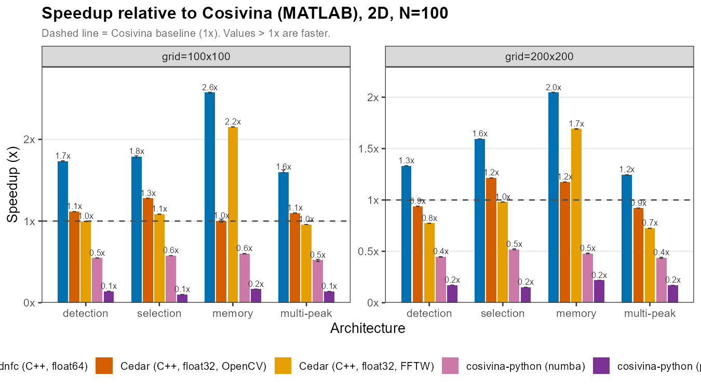

# DFT Framework Benchmark Report (2D)

The 2D counterpart of [`../benchmarking/`](../benchmarking/README.md). Same design and protocol,
with each neural field promoted to a **100×100 or 200×200 grid** (10 000/40 000 cells vs 100/500 in
1D). This is the regime where the lateral **convolution cost dominates**, so the framework ranking
can differ from 1D — each framework's 2D convolution (OpenCV/FFTW vs direct separable, JIT vs
interpreted) scales differently with the number of grid points.

## Test Machine

| Property | Value |
|---|---|
| CPU | 13th Gen Intel Core i9-13900 (24 cores / 32 threads, up to 5.6 GHz boost) |
| RAM | 32 GB |
| OS | Windows 11 Pro (build 10.0.26200), 64-bit |
| Power plan | High performance |
| Compiler (Cedar / dnfc) | MSVC 19.44 (VS 2022), C++20, Release `/O2 /Ob2 /DNDEBUG`; dnfc `/arch:AVX2` |
| MATLAB version | R2024b, `maxNumCompThreads(1)` |
| Python version | 3.11.9; numpy 2.2.1; numba 0.66.0 |
| dnfc version | 2.9.3 (`/arch:AVX2`; cache-blocked, ILP-unrolled separable convolution, fused state-metrics; logistic sigmoid in float64) |
| Cedar version | 6.2.0 — **both** convolution engines benchmarked: OpenCV (spatial) and FFTW (spectral); `cv::setNumThreads(0)` |
| Cosivina version | 1.4.0 |
| cosivina-python version | 0.1.0 (numba JIT and pure-NumPy paths both benchmarked) |

**Single-threading is enforced** the same way as the 1D study (Python thread-env pinned to 1 before
numpy import; MATLAB `maxNumCompThreads(1)`; Cedar `cv::setNumThreads(0)`; dnfc is scalar C++).
See [`../benchmarking/README.md`](../benchmarking/README.md) (*Test Machine*, *Data provenance*) and
[`../TRADE_OFF_CAVEATS.md`](../TRADE_OFF_CAVEATS.md) for the full environment, flags, and caveats —
they apply identically here.

---

## Benchmark Design

Each run creates **N independent neural fields** (N ∈ {5, 10, 50, 100}), tiled copies of one
**canonical DFT regime**, and times the integration loop — the same design as 1D, with each field
promoted to a 2D grid. The matrix is fully crossed:

**6 variants × 4 regimes × 2 grid sizes × 4 N × 5 runs.**

| Axis | Values |
|---|---|
| Framework variants | dnfc · Cedar (OpenCV) · Cedar (FFTW) · Cosivina (MATLAB) · cosivina-python (numba) · cosivina-python (NumPy) |
| Canonical regimes | detection · selection · memory · multi-peak |
| Grid size (2D) | 100×100, 200×200 |
| N (independent fields) | 5, 10, 50, 100 |
| Runs per cell | 5 (warm-up: 200 steps, discarded; timed: 2 000 steps) |

**Canonical regimes** are the 2D-adjusted counterparts of the 1D regimes (positions scale with grid
side, kernel σ values scale with the 2D amplitude adjustments used in cross-platform-validation):

| Regime | h | Lateral kernel | Stimuli |
|---|---|---|---|
| detection | −8 | Gauss (σ=3, a=8) | 1 |
| selection | −10 | Gauss (σ=3, a=20) + global inhibition −0.15 | 2 |
| memory | −5 | Mexican-hat (σ_exc=3.4 a=44.25, σ_inh=8.9 a=33.75, global −0.05) | 1 |
| multi-peak | −8 | Gauss (σ=2, a=5) | 2 |

**Noise is on:** every field includes a `NormalNoise2D` term with **amplitude A = 0.1**.

**Kernel cutoff, activation function, and the memory protocol are unified across frameworks the
same way as 1D** (see [`../benchmarking/README.md`](../benchmarking/README.md) *Benchmark Design*
for the full explanation of each): Cedar's `limit` is computed per σ/grid (`fairCedarLimit`) to
match dnfc's/cosivina's real tap count exactly (a flat `limit=5` would give Cedar roughly half the
real convolution work); Cedar uses `cedar.aux.math.ExpSigmoid` for *selection*, algebraically
identical to the other frameworks' logistic sigmoid; *memory* uses a two-phase protocol (100 steps
stimulus-on to establish the bump, then removed before the timed window) in every framework.

**Timing protocol:** only the step loop is timed (build, `init`, file I/O excluded). Reported value
is the **median of 5 runs**, with a **95% confidence interval on the mean** (t-interval) in
`data/benchmark_summary.csv` and drawn as the ribbon / error bars in the figures.

See [`../TRADE_OFF_CAVEATS.md`](../TRADE_OFF_CAVEATS.md) for the full set of trade-off caveats
(precision, convolution method, single-machine, multi-session environmental control, and the
correct scope of "faster" claims here) — identical to the 1D suite.

## How to reproduce

1. **Run each framework** (each appends to `data/timings-<framework>-2d.csv`):
   - dnfc: `runners/dnfc_benchmark/benchmark_headless_2d.cpp`, built inside the dnf-composer tree;
     run as `benchmark_headless_2d.exe <output_csv> <arch> <N_csv> <grid>`.
   - Cedar: `runners/cedar_benchmark/benchmark_2d.cpp`, built inside the Cedar tree
     (`cedar/executables/benchmark-2d/`); run as
     `benchmark_2d.exe <output_csv> <arch> <opencv|fftw> <N_csv> <grid>` with the dependency DLLs
     on PATH (see `../.claude/reports/cedar-notes.md`).
   - cosivina (MATLAB): `run('runners/cosivina_benchmark_2d.m')` (edit `ARCH_LIST`/`GRID_SIZES` to
     scope a re-run; defaults to the full 4-regime × 2-grid matrix).
   - cosivina-python: `python runners/cosivina_python_benchmark_2d.py <arch> <numba|nonumba> <N_csv> <grid>`.
   - `run_2d_benchmark.ps1` drives the full matrix for dnfc/Cedar/cosivina-python in one call (must
     run from PowerShell — the Cedar exes silent-exit under Git Bash).
2. **Aggregate & plot**: `Rscript analysis_2d.R` → `data/benchmark_summary.csv`;
   `Rscript fig_benchmark_2d.R` → `fig_benchmark_throughput.png`, `fig_benchmark_speedup.png`.

---

## Results

Measured at the fair protocol described above: matched kernel tap count, matched activation
function, two-phase memory. All six variants, all four regimes, both grid sizes — the previously
missing `multi-peak@200` cell (fftw's memory kernel didn't fit the smallest legacy grid) is now
included everywhere.

### Table 1 — Median steps/second at N=100 (5 runs)

Columns are *regime @ grid*. Higher is faster. See `data/benchmark_summary.csv` for per-cell mean,
SD, and 95% CI.

| Framework (variant) | det@100 | det@200 | sel@100 | sel@200 | mem@100 | mem@200 | mp@100 | mp@200 |
|---|---:|---:|---:|---:|---:|---:|---:|---:|
| **dnfc** (C++, float64) | 63.6 | 15.7 | 60.4 | 14.9 | 42.2 | 10.8 | 61.9 | 15.7 |
| Cosivina (MATLAB) | 36.7 | 11.8 | 33.8 | 9.3 | 16.4 | 5.3 | 38.6 | 12.6 |
| Cedar (OpenCV, float32) | 41.0 | 11.1 | 43.2 | 11.3 | 16.5 | 6.2 | 42.5 | 11.6 |
| Cedar (FFTW, float32) | 36.5 | 9.1 | 36.6 | 9.2 | 35.3 | 8.9 | 37.0 | 9.2 |
| cosivina-python (numba) | 20.1 | 5.3 | 19.5 | 4.8 | 9.8 | 2.5 | 20.2 | 5.5 |
| cosivina-python (NumPy) | 5.2 | 2.0 | 3.4 | 1.4 | 2.7 | 1.1 | 5.3 | 2.1 |

### Table 2 — Speedup relative to Cosivina (MATLAB), averaged across regimes at N=100

| Framework (variant) | grid=100 | grid=200 |
|---|---:|---:|
| dnfc | 1.9× (1.6–2.6×) | 1.6× (1.2–2.0×) |
| Cedar (FFTW) | 1.3× (1.0–2.2×) | 1.0× (0.7–1.7×) |
| Cedar (OpenCV) | 1.1× (1.0–1.3×) | 1.1× (0.9–1.2×) |
| Cosivina (MATLAB) | 1.0× | 1.0× |
| cosivina-python (numba) | 0.6× (0.5–0.6×) | 0.5× (0.4–0.5×) |
| cosivina-python (NumPy) | 0.1× (0.1–0.2×) | 0.2× (0.2–0.2×) |

## Key observations

- **dnfc wins every regime at both grids**, but by a much narrower margin than 1D (1.2–2.6× vs
  38–44× at 1D field=100) — in 2D the lateral convolution dominates the step, and Cedar/Cosivina's
  convolution paths (OpenCV `filter2D`, FFTW spectral, MATLAB's separable spatial `conv2`) are
  competitive with dnfc's cache-blocked separable convolution in a way that 1D's cheaper convolution
  never exposed.

- **Cosivina (MATLAB) is competitive with, and sometimes beats, both Cedar engines** — e.g.
  `multi-peak@200`: Cosivina 12.6 sps vs Cedar-OpenCV 11.6 vs Cedar-FFTW 9.2. This was surprising
  enough to investigate directly: it is not an artifact of the N=100 replication (the N=5→N=100
  scaling ratio is ~20–26× for every framework, matching the ideal linear-in-N ratio, so it isn't a
  per-instance-overhead effect), and it isn't a bug. Cedar is a general robotics/cognitive-
  architecture framework — every field-step pays a structural tax (Qt read/write locks,
  `Step::onTrigger` dispatch, `cv::copyMakeBorder` allocation for cyclic OpenCV convolution, a
  non-fused multi-pass Euler update) that MATLAB's comparatively lean cosivina loop does not, so a
  "slow, interpreted" MATLAB toolbox can beat a compiled C++ framework once that framework is
  spending most of its time on generality rather than the convolution itself (see
  `../.claude/reports/cedar-notes.md` for the source-level breakdown, and
  [`../TRADE_OFF_CAVEATS.md`](../TRADE_OFF_CAVEATS.md) §5 for how this bounds the "faster" claim).

- **Cedar-FFTW wins the `memory` regime specifically**, at both grids, over Cedar-OpenCV — its
  fused Mexican-hat Fourier multiply (one FFT pair instead of two spatial convolutions) is the one
  place FFTW's structural advantage shows through Cedar's overhead.

- **This result reverses an earlier, unfair measurement** in exactly the way the 1D suite did (see
  [`../benchmarking/README.md`](../benchmarking/README.md) *Key observations*) — the kernel-limit
  units bug affected 2D identically. No new dnfc optimization work was needed to win once the
  comparison was corrected.

---

## Data provenance

All six variants were measured on one machine (see *Test Machine* above); see
[`../TRADE_OFF_CAVEATS.md`](../TRADE_OFF_CAVEATS.md) §4 for the measurement's session structure and
what that does and doesn't bound. Each `data/timings-*-2d.csv` row is
`framework,variant,arch,field_size,mode,N,run,steps_per_second` (8 columns; `field_size` is the
grid side length). Regenerate all tables and figures with `Rscript analysis_2d.R` and
`Rscript fig_benchmark_2d.R`.

| Data file | Variants | Rows |
|---|---|---:|
| `data/timings-dnfc-2d.csv` | dnfc | 160 |
| `data/timings-cedar-2d.csv` | OpenCV + FFTW | 320 |
| `data/timings-cosivina-python-2d.csv` | numba + NumPy | 320 |
| `data/timings-cosivina-2d.csv` | Cosivina (MATLAB) | 160 |
