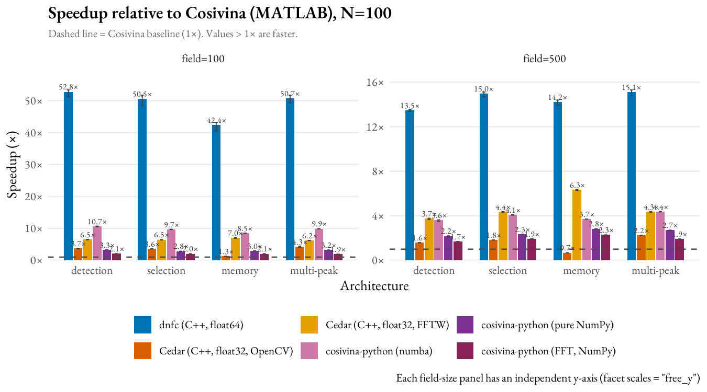

# DFT Framework Benchmark Report (1D)

Throughput (steps/second) of **N independent 1D neural fields** across six framework
variants, swept over four canonical DFT regimes and two field sizes. The 2D
counterpart lives in [`../benchmarking-2d/`](../benchmarking-2d/).

## Test Machine

| Property | Value |
|---|---|
| CPU | 13th Gen Intel Core i9-13900 (24 cores / 32 threads, up to 5.6 GHz boost) |
| RAM | 32 GB |
| OS | Windows 11 Pro (build 10.0.26200), 64-bit |
| Power plan | High performance (no CPU down-throttling during runs) |
| Compiler (Cedar / dnfc) | MSVC 19.44 (Visual Studio 2022 Community), C++20 |
| Release flags | `/O2 /Ob2 /DNDEBUG` (CMake Release); dnfc additionally built with `/arch:AVX2` |
| MATLAB version | R2024b, `maxNumCompThreads(1)` |
| Python version | 3.11.9; numpy 2.2.1; numba 0.66.0 |
| dnfc version | 2.9.3 (`/arch:AVX2`; cache-blocked, ILP-unrolled separable convolution, fused state-metrics; logistic sigmoid in float64) |
| Cedar version | 6.2.0 — **both** convolution engines benchmarked: OpenCV (spatial) and FFTW (spectral); `cv::setNumThreads(0)` |
| Cosivina version | 1.4.0 (MATLAB) |
| cosivina-python version | 0.1.0 (numba JIT and pure-NumPy paths both benchmarked) |

**Single-threading is enforced, not assumed.** Each runner pins its math-library thread pools to 1
before timing: Python sets `OMP_NUM_THREADS=OPENBLAS_NUM_THREADS=MKL_NUM_THREADS=NUMBA_NUM_THREADS=1`
(before numpy import); MATLAB calls `maxNumCompThreads(1)`; the Cedar runner calls
`cv::setNumThreads(0)` to disable OpenCV's internal threading; dnfc's loop is plain scalar C++ with no
thread pool. No CPU-affinity pinning was applied (single-threaded workloads do not require it).

---

## Benchmark Design

Each run creates **N independent neural fields** (N ∈ {5, 10, 50, 100}), tiled copies of one
**canonical DFT regime**, and times the integration loop. The matrix is fully crossed:

**6 variants × 4 regimes × 2 field sizes × 4 N × 5 runs.**

| Axis | Values |
|---|---|
| Framework variants | dnfc · Cedar (OpenCV) · Cedar (FFTW) · Cosivina (MATLAB) · cosivina-python (numba) · cosivina-python (NumPy) |
| Canonical regimes | detection · selection · memory · multi-peak |
| Field size (1D) | 100, 500 cells |
| N (independent fields) | 5, 10, 50, 100 |
| Runs per cell | 5 (warm-up: 200 steps, discarded; timed: 2 000 steps) |

**Canonical regimes** reuse the representative parameters of the cross-platform-validation suite:

| Regime | h | Lateral kernel | Stimuli |
|---|---|---|---|
| detection | −8 | Gauss (σ=3, a=8) | 1 |
| selection | −10 | Gauss (σ=3, a=5) + global inhibition −0.15 | 2 |
| memory | −5 | Mexican-hat (σ_exc=3.4 a=17.7, σ_inh=8.9 a=13.5) | 1 |
| multi-peak | −8 | Gauss (σ=2, a=5) | 2 |

**Noise is on:** every field includes a `NormalNoise` term with **amplitude A = 0.1**, so per-step
RNG cost is part of the measured workload.

**Kernel cutoff is unified across all six frameworks by real tap count, not by a shared nominal
parameter.** dnfc and cosivina/cosivina-python use `cutoffFactor=5` — a kernel-*radius* multiplier
(taps = 2·min(⌈5σ⌉, field-size cap)+1). Cedar's `limit` is a kernel-*width* multiplier
(taps = ⌈limit·σ⌉, rounded to odd) — a different unit, so naively setting `limit=5` gives Cedar
roughly **half** the real convolution work of the other frameworks (this was an actual bug in an
earlier protocol revision, not a deliberate choice). Cedar's `limit` is instead computed per σ and
field size (`fairCedarLimit`) to reproduce the *exact same tap count* dnfc uses, so every framework
convolves the same real kernel support.

**Activation function is matched for the *selection* regime.** dnfc/cosivina/cosivina-python use a
logistic sigmoid; Cedar is configured with `cedar.aux.math.ExpSigmoid`, algebraically identical
(`1/(1+exp(-β(x-θ)))`) to the others' sigmoid — verified by source comparison, not assumed. An
earlier protocol revision used Cedar's `AbsSigmoid` here, which never reached winner-take-all.

**The *memory* regime uses a two-phase protocol** in every framework: the stimulus is applied for
100 steps to establish the bump, then removed before the timed 2 000-step window begins. This
measures genuine self-sustained memory maintenance, not stimulus-driven integration.

**Position scaling:** kernel σ values are absolute (a fixed interaction range), held constant across
field sizes; only stimulus/kernel *positions* scale with field size so each regime is the same model
on a larger grid.

**Timing protocol:** only the step loop is timed (build, `init`, file I/O excluded). Reported value is
the **median of 5 runs**, with a **95% confidence interval on the mean** (t-interval) in
`data/benchmark_summary.csv` and drawn as the ribbon / error bars in the figures.

See [`../TRADE_OFF_CAVEATS.md`](../TRADE_OFF_CAVEATS.md) for the full set of trade-off caveats
(precision, convolution method, single-machine, etc.).

---

## Results

Measured at the fair protocol described above: matched kernel tap count, matched activation
function, two-phase memory. All six variants, all four regimes, both field sizes.

### Table 1 — Median steps/second at N=100 (5 runs)

Columns are *regime @ field size*. Higher is faster. See `data/benchmark_summary.csv` for per-cell
mean, SD, and 95% CI.

| Framework (variant) | det@100 | det@500 | sel@100 | sel@500 | mem@100 | mem@500 | mp@100 | mp@500 |
|---|---:|---:|---:|---:|---:|---:|---:|---:|
| **dnfc** (C++, float64) | 7 875 | 1 746 | 7 641 | 1 673 | 6 735 | 1 527 | 7 884 | 1 711 |
| cosivina-python (numba) | 1 597 | 459 | 1 429 | 459 | 1 330 | 384 | 1 579 | 487 |
| Cedar (FFTW, float32) | 988 | 481 | 984 | 480 | 1 112 | 678 | 998 | 283 |
| cosivina-python (NumPy) | 511 | 289 | 431 | 257 | 450 | 294 | 491 | 307 |
| Cedar (OpenCV, float32) | 556 | 207 | 552 | 204 | 202 | 73 | 684 | 253 |
| Cosivina (MATLAB) | 195 | 142 | 173 | 125 | 179 | 118 | 179 | 129 |

### Table 2 — Speedup relative to Cosivina (MATLAB), averaged across regimes at N=100

| Framework (variant) | field=100 | field=500 |
|---|---:|---:|
| dnfc | 41.6× (38–44×) | 13.0× (12–13×) |
| cosivina-python (numba) | 8.2× (7.4–8.8×) | 3.5× (3.2–3.8×) |
| Cedar (FFTW) | 5.6× (5.1–6.2×) | 3.8× (2.2–5.8×) |
| cosivina-python (NumPy) | 2.6× (2.5–2.8×) | 2.2× (2.0–2.5×) |
| Cedar (OpenCV) | 2.8× (1.1–3.8×) | 1.4× (0.6–2.0×) |
| Cosivina (MATLAB) | 1.0× | 1.0× |

---

## Key observations

- **dnfc is the fastest by a wide margin** in every regime and at both field sizes — 38–44× Cosivina
  at field=100, 12–13× at field=500. The lead is structural: compiled native C++ (`/arch:AVX2`) with
  a vectorized Euler loop and direct spatial convolution, computing in **float64 throughout**
  (including the logistic sigmoid).

- **Second place is cosivina-python (numba)** at both field sizes under the fair protocol (unlike an
  earlier, unfair measurement where second place flipped with field size) — its numba-JIT-compiled
  host code over direct spatial convolution (`np.convolve` / `parCircConv`, the same truncated
  kernel support dnfc uses) holds up well as the field grows.

- **Cedar-FFTW vs Cedar-OpenCV** (a clean *same-precision, same-framework* comparison): FFTW wins on
  the convolution-heavy **memory** (Mexican-hat) regime at both field sizes (e.g. memory@500: 659 vs
  71 sps) — its fused Fourier-domain multiply avoids the second spatial convolution OpenCV pays for.
  OpenCV is closer on the narrow-kernel regimes.

> **Precision caveat:** Cedar runs **float32**, all others **float64**. Throughput is per step, not
> per FLOP; Cedar's float32 SIMD-width advantage flatters its raw step rate. See
> [`../TRADE_OFF_CAVEATS.md`](../TRADE_OFF_CAVEATS.md).

---

## Data provenance

All six variants were measured on one machine (see *Test Machine* above); see
[`../TRADE_OFF_CAVEATS.md`](../TRADE_OFF_CAVEATS.md) §4 for the measurement's session structure and
what that does and doesn't bound. Each `data/timings-*.csv` row is
`framework,variant,arch,field_size,mode,N,run,steps_per_second` (8 columns). Regenerate all tables
and figures with `Rscript analysis.R` and `Rscript fig_benchmark.R`.

| Data file | Variants | Rows |
|---|---|---:|
| `data/timings-dnfc.csv` | dnfc | 160 |
| `data/timings-cedar.csv` | OpenCV + FFTW | 320 |
| `data/timings-cosivina-python.csv` | numba + NumPy | 320 |
| `data/timings-cosivina.csv` | Cosivina (MATLAB) | 160 |

All four files are uniform at **5 runs/cell** under the current 2000-step protocol (the whole
1D Cosivina suite was re-measured in one idle sitting; the earlier legacy 10-run non-memory rows
are gone).
