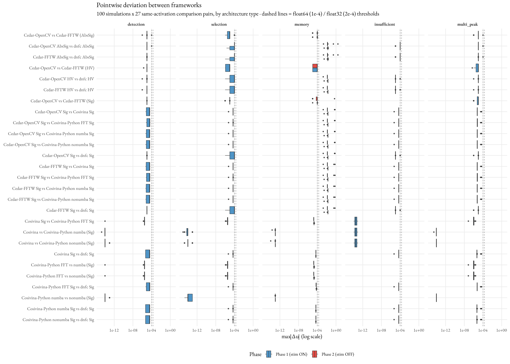
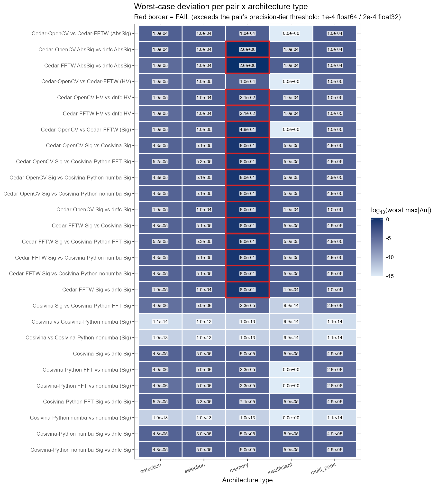
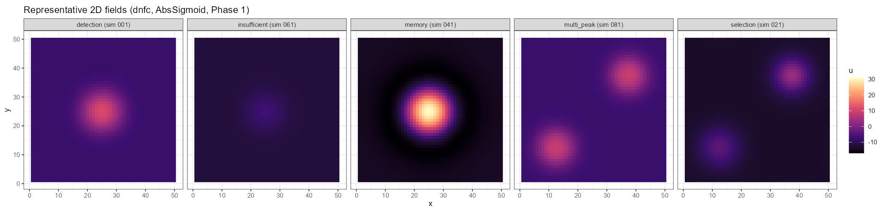
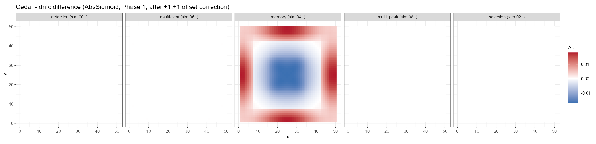

# 2D Cross-Platform Validation

The 2D counterpart of [`../cross-platform-validation/`](../cross-platform-validation/). It runs the
**same 100-simulation, 5-architecture test suite** on **2D (50×50) fields** across the DFT
framework **variants** and checks **algebraic equivalence** (same activation-function family agrees
to numerical precision) and **behavioural reliability** (qualitative bump/no-bump state agrees).

**Variants compared (7):** Cedar-OpenCV, Cedar-FFTW (C++, float32), Cosivina (MATLAB, float64),
cosivina-python-numba, cosivina-python-nonumba, cosivina-python-fft (Python, float64; the fft
variant uses cosivina's spectral `KernelFFT` element), dnfc (C++, float64) — same folder convention
as 1D.

**How the test suite was generated:** the 2D suite reuses the 1D 100-simulation parameter table
**verbatim** (imported from the 1D generator); only the embedding onto a 50×50 grid differs (see
`test_suite_2d.md`). For the LLM prompt that produced that table, see
[`../cross-platform-validation/README.md` §2.8](../cross-platform-validation/README.md).

## Layout

| Path | Contents |
|---|---|
| `generate_simulations_2d.py` | Generates all 1100 2D simulation files (reuses the 1D parameter table; see `test_suite_2d.md`) |
| `simulations/{cedar-opencv,cedar-fftw,cosivina,cosivina-python,dnfc}/` | Generated 2D simulation definitions (cosivina-python shared by both py variants) |
| `runners/<variant>/run.ps1` | Per-variant runner wrapper (cosivina via `cosivina_runner_2d.m`) |
| `data/<variant>/` | Output: one row of 2500 row-major-flattened activation values per sim × phase |
| `analysis_2d.R` | Loads all CSVs, computes pairwise deviations, PASS/FAIL + behavioural summary, figures |
| `test_suite_2d.md` | The 2D parameter mapping and per-type amplitude rules |

### Per-variant counts

| Variant | configs | CSVs (×2 phases) |
|---|---:|---:|
| cedar-opencv | 300 | 600 |
| cedar-fftw | 300 | 600 |
| cosivina (MATLAB) | 100 | 200 |
| cosivina-python-numba | 100 (shared) | 200 |
| cosivina-python-nonumba | 100 (shared) | 200 |
| cosivina-python-fft | 100 (shared) | 200 |
| dnfc | 300 | 600 |

## How to reproduce

1. **Generate**: `python generate_simulations_2d.py` → 1100 files (300 dnfc JSON, 300 cedar-opencv
   JSON, 300 cedar-fftw JSON, 100 cosivina `.m`, 100 cosivina-python `.py`).
2. **Run each variant** (each writes flattened 50×50 CSVs to `data/<variant>/`):
   - cedar-opencv / cedar-fftw: `runners/cedar-opencv/run.ps1` / `runners/cedar-fftw/run.ps1`
     (the fftw wrapper adds fftw3.dll to PATH; Cedar must be built with `CEDAR_USE_FFTW=ON`).
   - dnfc: `runners/dnfc/run.ps1`.
   - cosivina (MATLAB): `run('runners/cosivina_runner_2d.m')`.
   - cosivina-python: `runners/cosivina-python-numba/run.ps1`, `…-nonumba/run.ps1`, and
     `…-fft/run.ps1` (the fft variant uses the spectral `KernelFFT` element on the nonumba backend).
3. **Analyse**: `Rscript analysis_2d.R` → `analysis_summary.csv`, `validation_summary.csv`, and
   figures (`fig_fields_2d.png`, `fig_difference_2d.png`, `fig_boxplots.png`,
   `fig_deviation_summary.png`).

## Results

Behavioural and (float64) algebraic equivalence hold in 2D. Run over all seven variants
(Cedar-OpenCV, Cedar-FFTW, Cosivina, cosivina-python-numba, cosivina-python-nonumba,
cosivina-python-fft, dnfc):

### Behavioural reliability

**5400 / 5400 comparisons (100%)** agree on the qualitative field state (suprathreshold bump vs.
subthreshold resting) across all 27 same-activation pairs, architecture types, and phases.

Per-pair deviation distributions by architecture type (log scale; dashed lines = precision-tier
thresholds):

### Algebraic equivalence (same activation-function family, 27 pairs)

A quantitative `max|Δu|` test is only run **within** an activation-function family; every C(n,2)
variant pair is computed → 3 (AbsSig) + 3 (Heaviside) + 21 (Sigmoid, C(7,2): Cedar's two engines,
Cosivina, dnfc, and the three cosivina-python variants) = **27**. Max abs(Δu) is over 100 sims × 2
phases. Any pair with a Cedar side carries a 2×10⁻⁴ ceiling; all-float64 pairs 1×10⁻⁴. **12/27 pass,
15/27 fail** — every failure is isolated to the **memory** architecture type (confirmed per-type: all
four other types stay at the float32 rounding ceiling, ~1×10⁻⁴); the passing 12 are exactly the pairs
with no Cedar-vs-(dnfc/Cosivina/cosivina-python) leg at all (the two same-precision opencv↔fftw pairs
on AbsSig/HV, plus all ten all-float64 sigmoid pairs). The seventh variant, **cosivina-python-fft**,
uses the spectral `KernelFFT` element (full untruncated FFT convolution) rather than truncated
spatial convolution; its four all-float64 pairs pass (≤7.1×10⁻⁵), confirming FFT and spatial
convolution are numerically equivalent, and its two Cedar pairs fail on memory exactly like every
other float64 variant.

| Family | Pair | Max abs(Δu) | Threshold | Result |
|---|---|---:|---:|---|
| AbsSig | cedar_opencv_vs_cedar_fftw | 1.0×10⁻⁴ | 2×10⁻⁴ | **PASS** |
| AbsSig | cedar_opencv_vs_dnfc | 2.58 (memory) | 2×10⁻⁴ | **FAIL** memory only |
| AbsSig | cedar_fftw_vs_dnfc | 2.58 (memory) | 2×10⁻⁴ | **FAIL** memory only |
| Heaviside | cedar_opencv_vs_cedar_fftw | 1.0×10⁻⁴ | 2×10⁻⁴ | **PASS** |
| Heaviside | cedar_opencv_vs_dnfc | 0.021 (memory) | 2×10⁻⁴ | **FAIL** memory only |
| Heaviside | cedar_fftw_vs_dnfc | 0.021 (memory) | 2×10⁻⁴ | **FAIL** memory only |
| Sigmoid | cedar_opencv_vs_cedar_fftw | 0.489 (memory) | 2×10⁻⁴ | **FAIL** memory only |
| Sigmoid | cedar_opencv_vs_dnfc | 0.599 (memory) | 2×10⁻⁴ | **FAIL** memory only |
| Sigmoid | cedar_fftw_vs_dnfc | 0.599 (memory) | 2×10⁻⁴ | **FAIL** memory only |
| Sigmoid | cedar_opencv_vs_cosivina | 0.599 (memory) | 2×10⁻⁴ | **FAIL** memory only |
| Sigmoid | cedar_opencv_vs_cpy_numba | 0.599 (memory) | 2×10⁻⁴ | **FAIL** memory only |
| Sigmoid | cedar_opencv_vs_cpy_nonumba | 0.599 (memory) | 2×10⁻⁴ | **FAIL** memory only |
| Sigmoid | cedar_fftw_vs_cosivina | 0.599 (memory) | 2×10⁻⁴ | **FAIL** memory only |
| Sigmoid | cedar_fftw_vs_cpy_numba | 0.599 (memory) | 2×10⁻⁴ | **FAIL** memory only |
| Sigmoid | cedar_fftw_vs_cpy_nonumba | 0.599 (memory) | 2×10⁻⁴ | **FAIL** memory only |
| Sigmoid | cedar_opencv_vs_cpy_fft | 0.599 (memory) | 2×10⁻⁴ | **FAIL** memory only |
| Sigmoid | cedar_fftw_vs_cpy_fft | 0.599 (memory) | 2×10⁻⁴ | **FAIL** memory only |
| Sigmoid | cosivina_vs_cpy_numba | 1.0×10⁻¹³ | 1×10⁻⁴ | **PASS** |
| Sigmoid | cosivina_vs_cpy_nonumba | 1.0×10⁻¹³ | 1×10⁻⁴ | **PASS** |
| Sigmoid | cosivina_vs_cpy_fft | 2.3×10⁻⁵ | 1×10⁻⁴ | **PASS** |
| Sigmoid | cosivina_vs_dnfc | 5.0×10⁻⁵ | 1×10⁻⁴ | **PASS** |
| Sigmoid | cpy_numba_vs_cpy_nonumba | 1.0×10⁻¹³ | 1×10⁻⁴ | **PASS** |
| Sigmoid | cpy_fft_vs_cpy_numba | 2.3×10⁻⁵ | 1×10⁻⁴ | **PASS** |
| Sigmoid | cpy_fft_vs_cpy_nonumba | 2.3×10⁻⁵ | 1×10⁻⁴ | **PASS** |
| Sigmoid | cpy_fft_vs_dnfc | 7.1×10⁻⁵ | 1×10⁻⁴ | **PASS** |
| Sigmoid | cpy_numba_vs_dnfc | 5.0×10⁻⁵ | 1×10⁻⁴ | **PASS** |
| Sigmoid | cpy_nonumba_vs_dnfc | 5.0×10⁻⁵ | 1×10⁻⁴ | **PASS** |

- **All ten float64 sigmoid pairs are algebraically equivalent in 2D** to ≤7.1×10⁻⁵ across **every**
  sim and type, **including memory** (cosivina / cosivina-python / dnfc all ≤5×10⁻⁵; numba↔nonumba and
  cosivina↔cosivina-python ~1×10⁻¹³; the spectral **cosivina-python-fft** vs the spatial float64
  variants ≤7.1×10⁻⁵). This confirms the 2D separable convolution, border handling, and the
  self-sustaining bump's attractor are reproduced exactly across independent float64 implementations,
  and that **FFT convolution over the full field is numerically equivalent to truncated spatial
  convolution**.
- **Every Cedar-involving pair is PASS for detection, selection, insufficient, and multi-peak**
  (max ≤ 1×10⁻⁴) and **FAILs only on memory** — for every activation function and both engines alike.
  The self-sustaining bistable bump settles at a *different radius* in float32 (Cedar, either engine)
  vs float64 (e.g. sim 050: Cedar 177 cells vs dnfc 166), giving field-wide deviations up to **~2.6**
  — but the bump is **present in both**, so behaviour still agrees 100%.
- This is **intrinsic to Cedar's precision/convolution path, not tunable and not a bug.** A
  parameter sweep (global inhibition −0.05→−0.18; inhibitory amplitude ×2.5→×4.0) only **relocates**
  which sim's equilibrium radius lands on a ring boundary — it never eliminates the divergence, and
  stronger settings instead collapse the weaker bumps' self-sustain. The bistable bump radius is
  effectively quantized (a whole ring of cells switches at once), so for any parameter set some sim
  sits within epsilon of a ring boundary and a tiny perturbation tips it. The float64 pairs agree to
  5×10⁻⁵ on these *same* sims, so the cross-**precision** cause (Cedar float32 vs the three float64
  frameworks) is **precision, not the architecture.**
- **One failing pair is not a precision effect: `cedar_opencv_vs_cedar_fftw_sigmoid_b100` (max
  0.489, memory only) compares two Cedar engines at the *same* precision (both float32).** Here the
  divergence is purely a **convolution-method** effect — OpenCV's truncated spatial `filter2D` vs
  FFTW's full spectral convolution settle the bistable bump on different ring radii even with
  precision held constant. Read together with the point above: 2D memory-regime failures have *two*
  independent causes (precision, and convolution method), not one.

Worst-case deviation per pair × architecture type (annotated matrix; red border = FAIL, all on the
`memory` column):

Representative 2D fields (dnfc, AbsSigmoid, Phase 1):

Cedar − dnfc difference maps (after the +1,+1 offset correction) — only `memory` shows a
non-negligible difference, the ring-radius mismatch described above:

## Notes / findings

- **Cedar 2D offset:** Cedar's 2D field is shifted **+1 in both axes** vs dnfc; `analysis_2d.R`
  corrects this with a 2D roll (the analog of the 1D `roll_left`). After correction, non-memory
  same-family deviations drop to ≤ 1×10⁻⁴ (memory remains float32-limited as described above).