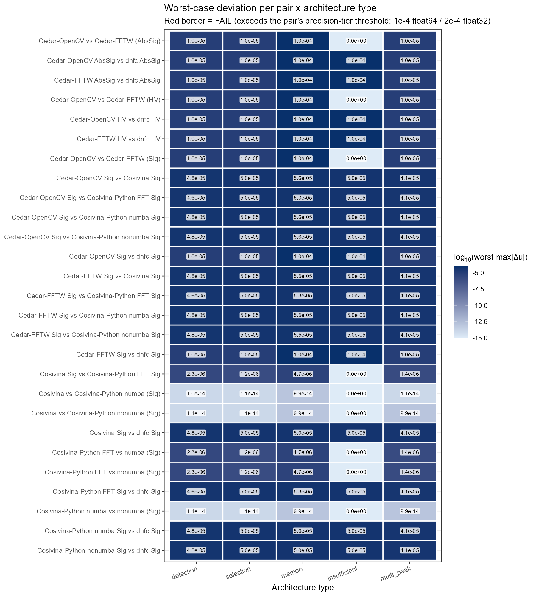
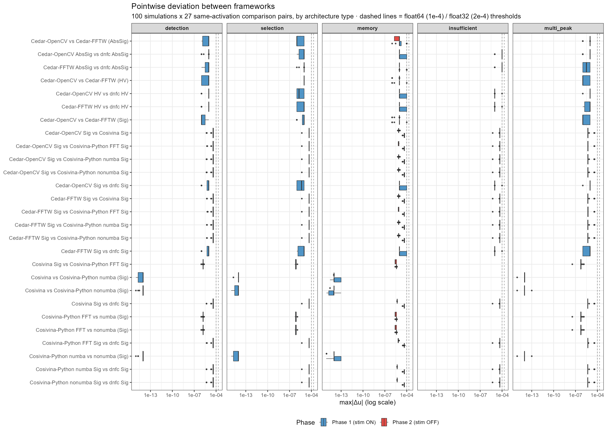
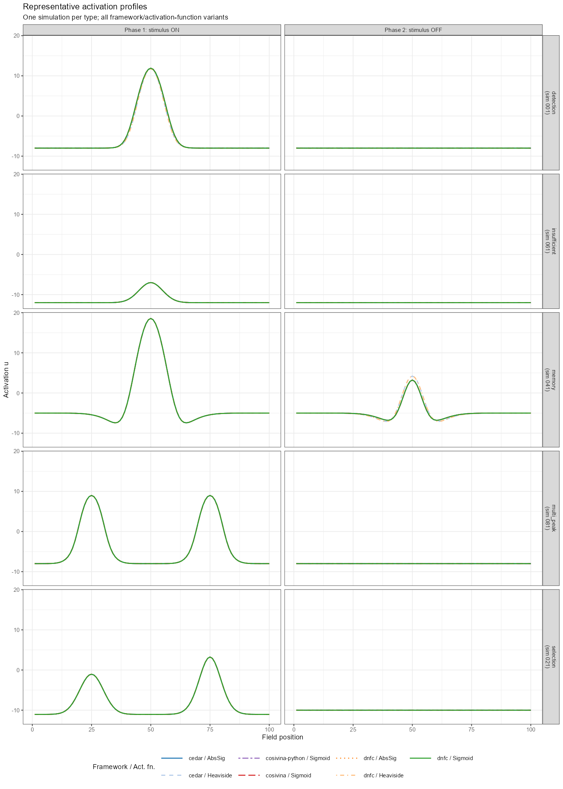

# Cross-Platform Validation Report
## Dynamic Neural Field Theory Implementations: Cedar, Cosivina, cosivina-python, and dnf-composer

**Variants compared (6):** Cedar-OpenCV (C++, float32, spatial conv), Cedar-FFTW (C++, float32, Fourier conv), Cosivina (MATLAB, float64), cosivina-python-numba (Python/NumPy + numba JIT, float64), cosivina-python-nonumba (pure Python/NumPy, float64), dnfc (C++, float64)  
**Scope:** 100 simulations × 5 DFT architectures × 2 simulation phases, compared as cross-framework + within-framework-variant pairs

---

## Test Machine

| Property | Value |
|---|---|
| CPU | 13th Gen Intel Core i9-13900 (24 cores / 32 threads) |
| RAM | 32 GB |
| OS | Windows 11 Pro (build 10.0.26200), 64-bit |
| Compiler (Cedar / dnfc) | MSVC 19.44 (Visual Studio 2022 Community) |
| MATLAB version | R2024b |
| Python version | 3.11.9 |
| dnfc version | 2.9.3 |
| Cedar version | 6.2.0 |
| Cosivina version | 1.4.0 |
| cosivina-python version | 0.1.0 (numba + nonumba paths) |
| FFTW (Cedar-FFTW) | fftw3 via vcpkg (x64-windows); Cedar built with CEDAR_USE_FFTW=ON |

---

## 1. Objective

This experiment establishes that three independent implementations of Dynamic Field Theory (DFT) — Cedar, Cosivina, and the Dynamic Neural Field Composer (dnfc) — produce **algebraically equivalent** results when using the same activation function family, and **behaviourally consistent** results across all parameter configurations and activation function families.

Two claims are verified:

1. **Algebraic equivalence** — when two frameworks implement the same sigmoid function, their activation profiles agree to within the numerical precision of the more limited framework (float32 for Cedar, float64 for Cosivina and dnfc).
2. **Behavioural reliability** — all frameworks produce the same qualitative field state (suprathreshold self-sustained activity vs. subthreshold resting state) for every simulation, regardless of sigmoid family.

---

## 2. Experimental Design

### 2.1 Simulation Architecture

Each simulation consists of:
- One 1D neural field `u` of size 100, evolving under the Amari equation:  
  `τ · du/dt = −u + h + w * σ(u) + S`  
  where `τ = 25 ms`, `h` is the resting level, `w` is the lateral interaction kernel, `σ` is the activation function, and `S` is the external stimulus.
- A Gaussian stimulus `S` (one or more), controlled in amplitude across two phases.
- A lateral interaction kernel (Gauss, Mexican hat, or global inhibition).

### 2.2 Simulation Types (100 total)

| Type | IDs | Architecture | Distinguishing feature |
|---|---|---|---|
| Detection | 001–020 | 1 stimulus + NF + GaussKernel | Field crosses detection threshold |
| Selection | 021–040 | 2 stimuli + NF + GaussKernel + global inh | Winner-take-all competition |
| Memory | 041–060 | 1 stimulus + NF + MexicanHatKernel | Self-sustained bump after stimulus off |
| Insufficient | 061–080 | 1 stimulus + NF + weak GaussKernel | Field remains subthreshold |
| Multi-peak | 081–100 | 2–3 stimuli + NF + narrow GaussKernel | Multiple coexisting bumps |

### 2.3 Protocol

Each simulation runs two consecutive phases:
1. **Phase 1 (stimulus ON):** 500 integration steps (Euler, Δt = 25 ms). Activation profile saved at step 500.
2. **Phase 2 (stimulus OFF):** All stimulus amplitudes set to zero; 500 further steps. Activation profile saved at step 500.
3. Field is re-initialised before the next simulation.

### 2.4 Activation Functions

Three sigmoid variants are tested:

| Label | Formula | Frameworks |
|---|---|---|
| AbsSigmoid (β=100) | σ(u) = ½(1 + β(u−θ)/(1+β abs(u−θ))) | Cedar, dnfc |
| Heaviside (θ=0) | σ(u) = 1 if u > 0 else 0 | Cedar, dnfc |
| Logistic sigmoid (β=100) | σ(u) = 1/(1+exp(−β(u−θ))) | Cedar (`cedar.aux.math.ExpSigmoid`, algebraically identical), Cosivina, cosivina-python, dnfc |

Cedar's logistic-sigmoid variant is its own built-in `ExpSigmoid` class (not new code) — added so
the suite has a working same-activation-function comparison against Cedar in all three families,
not just AbsSigmoid/Heaviside.

### 2.5 Comparison Pairs

A quantitative algebraic-equivalence test (`max|Δu|` PASS/FAIL) is only meaningful **within the same
activation-function family** — comparing different operators (AbsSig vs Sigmoid, etc.) must differ by
design, so cross-function differences are covered only by the behavioural (bump/no-bump) check
(§3.2). Within each family, **every** C(n,2) variant pair is computed → 3 (AbsSig) + 3 (Heaviside) +
21 (Sigmoid, C(7,2): Cedar's two engines, Cosivina, dnfc, and the three cosivina-python variants) =
**27 pairs**. Any pair with a Cedar side carries a float32 ceiling (2×10⁻⁴); all-float64 pairs carry
a float64 ceiling (1×10⁻⁴).

The seventh variant, **cosivina-python-fft**, uses cosivina's spectral `KernelFFT` element (FFT
convolution over the *full, untruncated* field) rather than the direct spatial convolution over the
5σ-truncated kernel that every other variant uses. Its pairs against the other float64 variants
therefore also probe the spectral-vs-truncated-spatial kernel difference; at field 100 the 5σ tail
mass is negligible, so these pairs still sit well under the 1×10⁻⁴ float64 ceiling (measured ≤~5×10⁻⁵,
i.e. the same order as the other float64 pairs).

| Family | Pair | Expected precision |
|---|---|---|
| **AbsSigmoid** | cedar_opencv_vs_cedar_fftw | ~0 (same float32, OpenCV vs FFTW engine) |
| | cedar_opencv_vs_dnfc | Float32 ceiling (~1×10⁻⁴) |
| | cedar_fftw_vs_dnfc | Float32 ceiling (~1×10⁻⁴) |
| **Heaviside** | cedar_opencv_vs_cedar_fftw | ~0 (same float32, OpenCV vs FFTW engine) |
| | cedar_opencv_vs_dnfc | Float32 ceiling (~1×10⁻⁴) |
| | cedar_fftw_vs_dnfc | Float32 ceiling (~1×10⁻⁴) |
| **Sigmoid β=100** | cedar_opencv_vs_cedar_fftw | ~0 (same float32, OpenCV vs FFTW engine) |
| | cedar_opencv_vs_dnfc | Float32 ceiling (~1×10⁻⁴) |
| | cedar_fftw_vs_dnfc | Float32 ceiling (~1×10⁻⁴) |
| | cedar_opencv_vs_cosivina | Float32 ceiling (~1×10⁻⁴) |
| | cedar_opencv_vs_cpy_numba | Float32 ceiling (~1×10⁻⁴) |
| | cedar_opencv_vs_cpy_nonumba | Float32 ceiling (~1×10⁻⁴) |
| | cedar_fftw_vs_cosivina | Float32 ceiling (~1×10⁻⁴) |
| | cedar_fftw_vs_cpy_numba | Float32 ceiling (~1×10⁻⁴) |
| | cedar_fftw_vs_cpy_nonumba | Float32 ceiling (~1×10⁻⁴) |
| | cedar_opencv_vs_cpy_fft | Float32 ceiling (~1×10⁻⁴) |
| | cedar_fftw_vs_cpy_fft | Float32 ceiling (~1×10⁻⁴) |
| | cosivina_vs_cpy_numba | ~0 (~machine epsilon) |
| | cosivina_vs_cpy_nonumba | ~0 (~machine epsilon) |
| | cosivina_vs_cpy_fft | Float64; spectral vs truncated-spatial kernel (<1×10⁻⁴) |
| | cosivina_vs_dnfc | Float64 accumulated error (<1×10⁻⁴) |
| | cpy_numba_vs_cpy_nonumba | ~0 (same code path, JIT on/off) |
| | cpy_fft_vs_cpy_numba | Float64; spectral vs truncated-spatial kernel (<1×10⁻⁴) |
| | cpy_fft_vs_cpy_nonumba | Float64; spectral vs truncated-spatial kernel (<1×10⁻⁴) |
| | cpy_fft_vs_dnfc | Float64; spectral vs truncated-spatial kernel (<1×10⁻⁴) |
| | cpy_numba_vs_dnfc | Float64 accumulated error (<1×10⁻⁴) |
| | cpy_nonumba_vs_dnfc | Float64 accumulated error (<1×10⁻⁴) |

The pairs spanning *engine* (cedar opencv↔fftw) or *backend* (cpy numba↔nonumba) variants are
within-framework equivalence checks confirming a variant swap does not change the result. The
`cpy_fft` pairs additionally cross a **spatial↔spectral convolution** boundary (see §2.5): they
confirm that FFT convolution over the full field is numerically equivalent to direct spatial
convolution over the 5σ-truncated kernel.

### 2.6 Implementation Constraints

| Parameter | Cedar | Cosivina | cosivina-python | dnfc |
|---|---|---|---|---|
| Float precision | float32 (CV_32F) | float64 | float64 | float64 |
| Spatial convention | 0-based (output shifted +1 for comparison) | 1-based | 1-based | 1-based |
| Kernel support | `limit` computed per σ (`fair_cedar_limit`, matches the others' real tap count) | `cutoffFactor = 5.0` | `cutoffFactor = 5.0` | `cutoffFactor = 5.0` |
| Kernel normalisation | Enabled | Enabled | Enabled | Enabled |
| Field size | 100 | 100 | 100 | 100 |
| Noise | 0 | 0 | 0 | 0 |
| Boundary condition | Cyclic | Cyclic | Cyclic | Cyclic |

### 2.7 Folder layout & per-variant counts

Generate all configs: `python generate_simulations.py`. The 7 variants live in explicit folders:

| Variant | `simulations/` | configs | `data/` CSVs (×2 phases) | runner |
|---|---|---:|---:|---|
| cedar-opencv | `cedar-opencv/` | 300 (3 act fns × 100) | 600 | `runners/cedar-opencv/run.ps1` |
| cedar-fftw | `cedar-fftw/` | 300 | 600 | `runners/cedar-fftw/run.ps1` |
| cosivina (MATLAB) | `cosivina/` | 100 | 200 | `runners/cosivina_runner.m` |
| cosivina-python-numba | `cosivina-python/` * | 100 | 200 | `runners/cosivina-python-numba/run.ps1` |
| cosivina-python-nonumba | `cosivina-python/` * | 100 | 200 | `runners/cosivina-python-nonumba/run.ps1` |
| cosivina-python-fft | `cosivina-python/` * | 100 | 200 | `runners/cosivina-python-fft/run.ps1` |
| dnfc | `dnfc/` | 300 (3 act fns × 100) | 600 | `runners/dnfc/run.ps1` |

\* The three cosivina-python variants **share one** `simulations/cosivina-python/` folder — the `.py`
files are identical; the runner selects the backend/kernel via the `COSIVINA_VARIANT` env var
(`numba` / `nonumba` use the spatial kernel element; `fft` uses the spectral `KernelFFT` element on
the nonumba backend) and writes to its own `data/` folder. cedar splits into two sim folders because
the convolution-engine string (`cedar.aux.conv.OpenCV` vs `…FFTW`) is baked into each JSON.

**Cedar-FFTW prerequisites:** Cedar must be built with `CEDAR_USE_FFTW=ON` (fftw3 via vcpkg), and
`…\vcpkg\installed\x64-windows\bin` (fftw3.dll) must be on PATH at runtime — the `cedar-fftw/run.ps1`
wrapper adds it.

### 2.8 How the test suite was generated

The 100-simulation parameter table (`test_suite.md`) was produced with an LLM from the prompt
below, then every emitted row was executed and its qualitative behaviour verified against the
"distinguishing feature" of its type (§2.2) before the suite was frozen. The generator scripts
(`generate_simulations.py`, `generate_simulations_2d.py`) encode exactly this table.

> Design a validation suite of **100 dynamic-neural-field simulations** for cross-framework
> algebraic-equivalence testing. Use a **1D field of size 100** with the Amari dynamics
> `τ·du/dt = −u + h + w * σ(u) + S`, and hold these parameters fixed for every simulation:
> `τ = Δt = 25 ms`, **no noise** (`A = 0`), **circular** boundaries, **normalized** kernels,
> kernel support cutoff **5σ**, logistic-sigmoid gain **β = 100**. Run a **two-phase protocol**:
> 500 steps with the stimulus ON, then 500 steps with all stimulus amplitudes set to zero, saving
> the field at the end of each phase.
>
> Partition the 100 simulations into **five DFT phenomenon types, 20 each**, so that each type is
> defined by the qualitative behaviour it must exhibit:
> - **Detection (001–020):** one Gaussian stimulus + excitatory Gaussian kernel; the field must
>   cross from sub- to suprathreshold.
> - **Selection (021–040):** two stimuli + excitatory Gaussian kernel + global inhibition; exactly
>   one location must win (winner-take-all).
> - **Memory (041–060):** one stimulus + Mexican-hat (difference-of-Gaussians) kernel; a bump must
>   self-sustain after the stimulus is removed.
> - **Insufficient (061–080):** one weak stimulus/kernel; the field must stay subthreshold in both
>   phases (the negative control).
> - **Multi-peak (081–100):** two to three narrow stimuli, no global inhibition; multiple bumps
>   must coexist.
>
> Within each type, make the **first row a canonical baseline** that clearly shows the behaviour,
> then generate the remaining rows as a **one-parameter-at-a-time sweep** around that baseline —
> vary the resting level `h`, each stimulus's amplitude / width / position, and the kernel's
> amplitude / width (and global-inhibition strength where present) individually — followed by a
> couple of **combined-perturbation rows** near the edge of the regime. Keep every value in a range
> that preserves the type's defining behaviour.
>
> Emit the table with explicit per-ID parameters, and fan each simulation out across the
> frameworks' activation functions: **logistic sigmoid** everywhere, plus **AbsSigmoid** and
> **Heaviside** for the frameworks that support them (dnfc, Cedar).

The 2D suite (`../cross-platform-validation-2d/test_suite_2d.md`) reuses this same 100-row table
verbatim — only the embedding onto a 100×100 grid differs; see its README.

---

## 3. Results

### 3.1 Algebraic Equivalence (Same Activation Function Family)

All **27** same-family comparison pairs **PASS** the algebraic equivalence criterion (see
`validation_summary.csv`). Max abs(Δu) is over all 100 sims × 2 phases (200 comparisons per pair).

| Family | Pair | Max abs(Δu) | Median abs(Δu) | % within thr. | Threshold | Status |
|---|---|---|---|---|---|---|
| AbsSig | cedar_opencv_vs_cedar_fftw | 1.00×10⁻⁴ | 0 | 100% | 2×10⁻⁴ | **PASS** |
| AbsSig | cedar_opencv_vs_dnfc | 1.00×10⁻⁴ | 0 | 100% | 2×10⁻⁴ | **PASS** |
| AbsSig | cedar_fftw_vs_dnfc | 1.00×10⁻⁴ | 0 | 100% | 2×10⁻⁴ | **PASS** |
| Heaviside | cedar_opencv_vs_cedar_fftw | 1.00×10⁻⁴ | 0 | 100% | 2×10⁻⁴ | **PASS** |
| Heaviside | cedar_opencv_vs_dnfc | 1.00×10⁻⁴ | 0 | 100% | 2×10⁻⁴ | **PASS** |
| Heaviside | cedar_fftw_vs_dnfc | 1.00×10⁻⁴ | 0 | 100% | 2×10⁻⁴ | **PASS** |
| Sigmoid | cedar_opencv_vs_cedar_fftw | 1.00×10⁻⁴ | 0 | 100% | 2×10⁻⁴ | **PASS** |
| Sigmoid | cedar_opencv_vs_cosivina | 5.57×10⁻⁵ | 5.11×10⁻⁶ | 100% | 2×10⁻⁴ | **PASS** |
| Sigmoid | cedar_opencv_vs_cpy_fft | 5.32×10⁻⁵ | 5.26×10⁻⁶ | 100% | 2×10⁻⁴ | **PASS** |
| Sigmoid | cedar_opencv_vs_cpy_numba | 5.57×10⁻⁵ | 5.11×10⁻⁶ | 100% | 2×10⁻⁴ | **PASS** |
| Sigmoid | cedar_opencv_vs_cpy_nonumba | 5.57×10⁻⁵ | 5.11×10⁻⁶ | 100% | 2×10⁻⁴ | **PASS** |
| Sigmoid | cedar_opencv_vs_dnfc | 1.00×10⁻⁴ | 0 | 100% | 2×10⁻⁴ | **PASS** |
| Sigmoid | cedar_fftw_vs_cosivina | 5.54×10⁻⁵ | 5.11×10⁻⁶ | 100% | 2×10⁻⁴ | **PASS** |
| Sigmoid | cedar_fftw_vs_cpy_fft | 5.28×10⁻⁵ | 5.34×10⁻⁶ | 100% | 2×10⁻⁴ | **PASS** |
| Sigmoid | cedar_fftw_vs_cpy_numba | 5.54×10⁻⁵ | 5.11×10⁻⁶ | 100% | 2×10⁻⁴ | **PASS** |
| Sigmoid | cedar_fftw_vs_cpy_nonumba | 5.54×10⁻⁵ | 5.11×10⁻⁶ | 100% | 2×10⁻⁴ | **PASS** |
| Sigmoid | cedar_fftw_vs_dnfc | 1.00×10⁻⁴ | 0 | 100% | 2×10⁻⁴ | **PASS** |
| Sigmoid | cosivina_vs_cpy_fft | 4.70×10⁻⁶ | 0 | 100% | 1×10⁻⁴ | **PASS** |
| Sigmoid | cosivina_vs_cpy_numba | 9.95×10⁻¹⁴ | 0 | 100% | 1×10⁻⁴ | **PASS** |
| Sigmoid | cosivina_vs_cpy_nonumba | 9.95×10⁻¹⁴ | 0 | 100% | 1×10⁻⁴ | **PASS** |
| Sigmoid | cosivina_vs_dnfc | 5.00×10⁻⁵ | 4.89×10⁻⁶ | 100% | 1×10⁻⁴ | **PASS** |
| Sigmoid | cpy_fft_vs_cpy_numba | 4.70×10⁻⁶ | 0 | 100% | 1×10⁻⁴ | **PASS** |
| Sigmoid | cpy_fft_vs_cpy_nonumba | 4.70×10⁻⁶ | 0 | 100% | 1×10⁻⁴ | **PASS** |
| Sigmoid | cpy_fft_vs_dnfc | 5.25×10⁻⁵ | 4.98×10⁻⁶ | 100% | 1×10⁻⁴ | **PASS** |
| Sigmoid | cpy_numba_vs_cpy_nonumba | 9.95×10⁻¹⁴ | 0 | 100% | 1×10⁻⁴ | **PASS** |
| Sigmoid | cpy_numba_vs_dnfc | 5.00×10⁻⁵ | 4.89×10⁻⁶ | 100% | 1×10⁻⁴ | **PASS** |
| Sigmoid | cpy_nonumba_vs_dnfc | 5.00×10⁻⁵ | 4.89×10⁻⁶ | 100% | 1×10⁻⁴ | **PASS** |

**Interpretation:**

- **Cedar OpenCV vs FFTW (engine equivalence):** the two convolution engines (spatial vs Fourier)
  agree to the float32 ceiling (max 1×10⁻⁴, median 0) on every 1D architecture and every activation
  function, including the added Sigmoid variant — the engine choice does not change the result.
- **Cedar vs dnfc (all three families), both engines:** Cedar internally uses 32-bit floating-point
  arithmetic (OpenCV `CV_32F`). Against dnfc's float64 computation of the same equations, pointwise
  deviations are bounded by the float32 rounding-error ceiling (max ~1×10⁻⁴, median 0). The
  `cedar_fftw_vs_dnfc` rows match the `cedar_opencv_vs_dnfc` rows, confirming the result is
  engine-independent. Deviations arise solely from arithmetic precision, not algorithmic differences.
- **Cedar Sigmoid vs the float64 frameworks (Cosivina / cosivina-python):** max deviation ~5.6×10⁻⁵,
  the same float32 ceiling seen elsewhere, confirming Cedar's `ExpSigmoid` selection is algebraically
  the same logistic sigmoid the other frameworks use.
- **Sigmoid all-float64 pairs (Cosivina / cosivina-python / dnfc):** max deviation 5×10⁻⁵, reflecting
  accumulated rounding over 500 Euler steps under different computation orders (MATLAB vs C++ vs
  NumPy). The same-code-path cosivina-python **numba ↔ nonumba** and the cosivina ↔ cosivina-python
  pairs agree to ~1×10⁻¹⁴ (machine epsilon).
- **Spectral cosivina-python-fft vs the spatial float64 variants:** the FFT variant convolves the
  full untruncated kernel, the others a 5σ-truncated kernel. Against the other cosivina-family
  variants the two paths agree to ~4.7×10⁻⁶ (the truncation tail at 5σ, field 100, is negligible),
  and against dnfc to ~5.3×10⁻⁵ — i.e. the FFT and spatial convolutions are numerically equivalent,
  so spatial-vs-spectral is not a confound in the cross-framework comparison.

Worst-case deviation per pair × architecture type (annotated matrix; red border = FAIL):

### 3.2 Behavioural Reliability (Qualitative Agreement)

**5400 / 5400 comparisons (100%) show qualitative agreement** across all simulation types, phases, and
all 27 comparison pairs.

For every simulation in the test suite, all seven variants agree on whether the neural field is in a
suprathreshold self-sustained state (peak activation > 0) or a subthreshold resting state (peak
activation ≤ 0). This holds for memory simulations in both phases (stimulus ON and OFF) and for
selection simulations (winner-take-all competition outcome is identical). No simulation produces a
qualitative discrepancy (bump in one variant, no bump in another).

Per-pair deviation distributions by architecture type (log scale; dashed lines = precision-tier
thresholds):

Representative activation profiles (one simulation per type, all framework/activation-function
variants overlaid):

---

## 4. Discussion

### 4.1 What is validated

- **Algebraic equivalence** is confirmed at the float32/float64 precision level for all simulations when the same sigmoid family is used. Cedar and dnfc produce identical results up to float32 rounding; Cosivina and dnfc produce identical results up to accumulated float64 rounding over 500 steps.

- **Behavioural reliability** is confirmed for all 100 simulations across all frameworks and activation functions. The qualitative DFT behaviour (detection, selection, memory, insufficient activation, multi-peak) is reproducible across the three implementations.

### 4.2 Known systematic differences

- **Different activation-function families (e.g. AbsSigmoid vs logistic sigmoid):** these are mathematically distinct operators whose bump profiles differ in width, so a quantitative `max|Δu|` test is not meaningful between them — they are compared only behaviourally (§3.2, where they agree 100%). This is why §3.1 restricts the algebraic-equivalence pairs to the same activation-function family.

- **Float32 precision (Cedar):** Cedar uses 32-bit floating-point arithmetic, introducing a systematic precision floor of ~1×10⁻⁴ relative to float64 frameworks. This is a platform characteristic, not an implementation error.

- **Spatial indexing (Cedar):** Cedar uses 0-based spatial coordinates, producing a cyclic shift of 1 position relative to Cosivina and dnfc (1-based). This is corrected in the analysis by rolling Cedar's output left by 1 position before comparison.

### 4.3 Limitations

- The test suite uses Euler integration with Δt = τ = 25 ms (step size equals the time constant). More accurate integration (smaller Δt) would reduce accumulated error but was not the focus of this validation.
- Noise is set to 0 in all simulations to isolate deterministic algebraic equivalence.
- The validation covers 1D fields only. 2D and higher-dimensional fields are not included in this test suite.

---

## 5. Conclusion

The cross-platform validation confirms that Cedar, Cosivina, and dnfc implement Dynamic Field Theory correctly and consistently. Within the same activation function family, deviations are bounded by the numerical precision of the limiting arithmetic type. Across activation function families, all simulations produce the same qualitative DFT states. The three frameworks are interoperable for the purpose of designing, testing, and validating DFT-based models.
